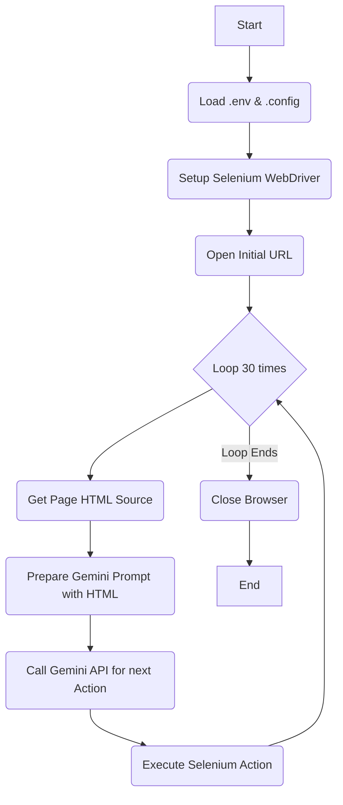

# Simple Browser Agent

This project implements a Python-based browser automation agent that leverages the Google Gemini API to dynamically determine and execute actions on a webpage.

## Table of Contents

-   [Features](#features)
-   [Installation](#installation)
-   [Usage](#usage)
-   [Dependencies](#dependencies)
-   [Project Structure](#project-structure)
-   [Workflow Diagram](#workflow-diagram)
-   [Ignored Files](#ignored-files)

## Features

*   Automated web browsing using Selenium.
*   Dynamic action generation via Google Gemini API based on current page HTML.
*   Configurable initial URL and task description.

## Installation

### Prerequisites

*   Python 3.x
*   Google Chrome browser installed

### Setup Steps

You can use the provided setup scripts for convenience.

**For Linux/macOS:**

```bash
./setup.sh
```

**For Windows:**

```batch
setup.bat
```

These scripts will:
1.  Create a Python virtual environment (`venv`).
2.  Activate the virtual environment.
3.  Install all necessary dependencies from `requirements.txt`.

## Usage

Before running, ensure you have a `.env` file (for Gemini API key, e.g., `GEMINI_API_KEY=YOUR_API_KEY`) and a `.config` file with `first_url`, `task_description`, and `other_information` in a `[default]` section.

Example `.config` content:
```ini
[default]
first_url = https://www.example.com
task_description = Navigate to the contact page and fill out the form.
other_information = Use the contact link if available.
```

To run the agent:

```bash
# Make sure your virtual environment is activated
source venv/bin/activate # Linux/macOS
# or
venv\Scripts\activate.bat # Windows

python simpleBrowserAgent.py
```

The agent will open the specified URL and proceed to interact with the page based on Gemini's suggestions for a set number of iterations.

## Dependencies

The project relies on the following Python libraries, listed in `requirements.txt`:

```
google-genai
python-dotenv
pathspec
selenium
webdriver-manager
beautifulsoup4
```

## Project Structure

```
.
├── .config
├── .env
├── .gitignore
├── requirements.txt
├── setup.bat
├── setup.sh
└── simpleBrowserAgent.py
```

## Workflow Diagram



## Ignored Files

The following files and directories are ignored by Git, as specified in `.gitignore`:

*   `venv/`
*   `.env`
*   `.config`
*   `.git/`