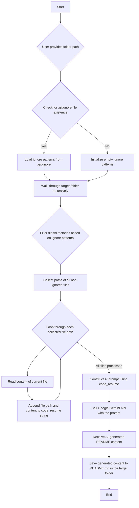

# README Generator

This project provides a Python-based solution for automatically generating project `README.md` files. It leverages the Google Gemini AI model to analyze project source code and structure, respecting `.gitignore` rules, to produce comprehensive and relevant documentation.

## Features

-   **AI-Powered Content Generation**: Utilizes Google Gemini to draft README content based on project files.
-   **`.gitignore` Compliance**: Automatically excludes specified files and directories from the analysis.
-   **Contextual Understanding**: Gathers code and file paths to create a rich context for the AI model.
-   **Simplified Setup**: Includes scripts for quick environment setup and dependency installation across different operating systems.

## Project Structure

```
.
├── .gitignore          # Specifies files and directories to be ignored
├── create_md.py        # Core script for README generation
├── requirements.txt    # Lists Python package dependencies
├── setup.bat           # Windows batch script for environment setup
├── setup.sh            # Bash script for environment setup (Linux/macOS)
├── venv/               # Python virtual environment (ignored)
└── README.md           # Generated README file
```

## Setup

To prepare the project environment, execute the appropriate setup script for your operating system:

*   **For Windows:**
    ```bash
    setup.bat
    ```
*   **For Linux/macOS:**
    ```bash
    ./setup.sh
    ```
These scripts will create a Python virtual environment (`venv/`) and install all required dependencies listed in `requirements.txt`. Ensure Python is installed and accessible in your system's PATH.

## Dependencies

The project relies on the following Python libraries, automatically installed by the setup scripts:

-   `google-genai`: Essential for interacting with the Google Gemini API.
-   `python-dotenv`: Used for loading environment variables from a `.env` file, typically for API keys.
-   `pathspec`: Enables pattern matching for `.gitignore` file exclusions.

## Usage

After completing the setup, follow these steps to generate a `README.md`:

1.  **Activate the Virtual Environment:**
    *   Windows:
        ```bash
        venv\Scripts\activate.bat
        ```
    *   Linux/macOS:
        ```bash
        source venv/bin/activate
        ```
2.  **Run the Generation Script:**
    ```bash
    python create_md.py
    ```
3.  **Provide Folder Path:** The script will prompt you to `Enter the path to the folder you want to generate a README for:`. Input the absolute or relative path to your desired project directory.
4.  **Output:** A `README.md` file will be created in the specified project folder, containing the AI-generated documentation.

## Workflow

The following diagram illustrates the operational flow of the `create_md.py` script:

