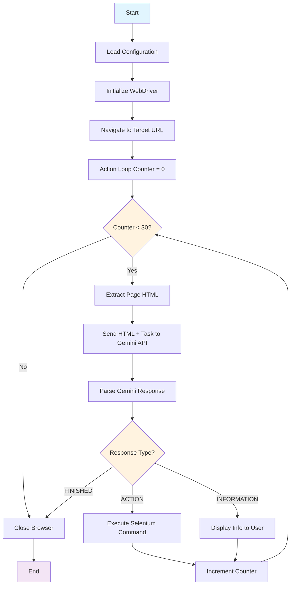

# Simple Browser Agent

A powerful browser automation agent designed to interact with web pages using AI-driven commands. This project leverages Selenium for browser control and Google Gemini for intelligent action suggestions based on the current page's HTML content and a defined task.

## 🚀 Features

*   **AI-Powered Navigation:** Utilizes Google Gemini to interpret web page content and suggest the next best action (e.g., click buttons, fill forms).
*   **Cross-Platform Setup:** Includes setup scripts for both Windows (`setup.bat`) and Unix-like systems (`setup.sh`) to easily prepare the environment.
*   **Configurable Tasks:** Easily define the target URL and the automation task using a simple `.config` file.
*   **Error Handling:** Includes basic error handling for failed actions and retries for AI model communication.
*   **Dynamic Browser Control:** Automates Chrome browser actions through Selenium.

## ⚙️ Prerequisites

Before you begin, ensure you have the following installed:

*   **Python 3.8+**: Download from [python.org](https://www.python.org/downloads/).
*   **Git**: Download from [git-scm.com](https://git-scm.com/downloads).
*   **Google Gemini API Key**: Obtain one from the [Google AI Studio](https://makersuite.google.com/app/apikey).

## 📦 Installation

Follow these steps to set up the project on your local machine.

### 1. Clone the Repository

```bash
git clone https://github.com/bintadik/simple-browser-agent.git
cd simple-browser-agent
```

### 2. Setup Environment and Dependencies

This project includes convenient setup scripts for different operating systems.

#### On Windows:

```bash
setup.bat
```

#### On Linux/macOS:

```bash
chmod +x setup.sh
./setup.sh
```

These scripts will:
*   Create a Python virtual environment (`venv`).
*   Activate the virtual environment.
*   Install all necessary Python packages listed in `requirements.txt`.

## 🛠️ Configuration

The agent requires two configuration files: `.env` and `.config`.

### `.env` File

Create a file named `.env` in the root directory and add your Google Gemini API key:

```
GOOGLE_API_KEY=YOUR_GEMINI_API_KEY
```
Replace `YOUR_GEMINI_API_KEY` with your actual API key.

### `.config` File

Create a file named `.config` in the root directory. This file defines the initial URL and the task description for the browser agent.

```ini
[default]
first_url = https://www.example.com
task_description = Browse the website and find the contact information.
other_information = Look for email addresses or phone numbers.
```

Adjust the `first_url`, `task_description`, and `other_information` to match your automation needs.

## 🚀 Usage

After installation and configuration, you can run the browser agent:

1.  **Activate the Virtual Environment (if not already active):**
    *   Windows: `venv\Scripts\activate.bat`
    *   Linux/macOS: `source venv/bin/activate`

2.  **Run the Agent:**

    ```bash
    python simpleBrowserAgent.py
    ```

The browser will open, and the agent will begin interacting with the specified `first_url` based on the `task_description` and AI's suggestions.

## 🌊 How it Works

The `simpleBrowserAgent.py` script orchestrates the entire automation process. Here's a high-level flow:



1.  **Initialization:** Loads API keys and configuration settings.
2.  **Browser Setup:** Initializes a Chrome browser instance using Selenium WebDriver.
3.  **Initial Navigation:** Navigates to the `first_url` specified in `.config`.
4.  **Action Loop:**
    *   The agent continuously fetches the current page's HTML content.
    *   This HTML, along with the `task_description` and `other_information`, is sent to the Google Gemini model.
    *   Gemini processes this input and suggests a single Selenium Python command (e.g., `driver.find_element(By.ID, "myButton").click()`) to perform the next logical step towards completing the task.
    *   The suggested command is executed within the browser.
    *   The loop continues for a predefined number of iterations or until Gemini signals that the task is `***FINISHED***` or requires user `***INFORMATION***`.

## 📂 Project Structure

```
simple-browser-agent/
├── .gitignore
├── .config
├── .env                  (Your API key and configurations - user created)
├── requirements.txt
├── setup.bat             (Windows setup script)
├── setup.sh              (Linux/macOS setup script)
├── simpleBrowserAgent.py (Main browser agent script)
└── venv/                 (Python virtual environment - automatically created)
```

*   `.gitignore`: Specifies files and directories to be ignored by Git (like `venv/`, `.env`, `.config`, `.git/`).
*   `.config`: Stores browser agent's initial URL, task description, and other relevant information.
*   `.env`: Holds environment variables, such as your Google Gemini API key.
*   `requirements.txt`: Lists all Python dependencies required for the project.
*   `setup.bat`: A batch script for setting up the environment on Windows.
*   `setup.sh`: A shell script for setting up the environment on Linux/macOS.
*   `simpleBrowserAgent.py`: The core Python script that implements the AI-driven browser agent.
*   `venv/`: A directory containing the isolated Python virtual environment and its installed packages.

## 🤝 Contributing

Contributions are welcome! If you have suggestions for improvements, new features, or bug fixes, please feel free to open an issue or submit a pull request.

## 📄 License

This project is open-sourced under the MIT License. See the [LICENSE](LICENSE) file for details.